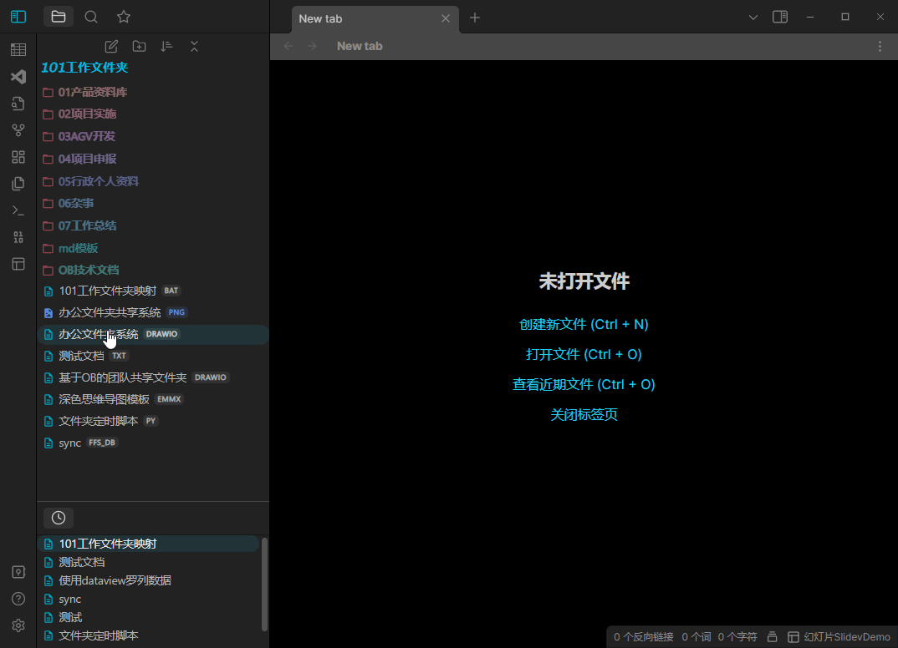

国内可以访问Gitee:https://gitee.com/one0oneChen/obsidian-101tool

**ChangeLog**

0.1.1 2023-01-28 亮色主题和暗色主题统一语法高亮模型, 调整亮色模式配色, 增加了自定义字体功能

---

纪念性质的一刻, 这是我开发的第一个Obsidian插件, 特别感谢ob中文社区的两位大佬 
[熊海 RealBigBrownBear](https://forum-zh.obsidian.md/u/%E7%86%8A%E6%B5%B7) 和 [renmu]([个人资料 - renmu - Obsidian 中文论坛](https://forum-zh.obsidian.md/u/renmu/summary)) 没有他们两位的帮助无法赶在春节假期完成这个插件!
**2023新年快乐~**
这是一个用于编辑Obsidian的除了markdown文档以外的其他格式文件的插件, 使用很简单.

**注意:** 
1. 开发这个插件是为了补足不能在OB里面编辑多种格式文本文件的缺陷并非码农专用(顺便学习ts,js,html,css...)
2. 要打开的文件必须本身是支持以明文文本方式编辑的!! 许多格式的文件其自身数据是加密的打开就是乱码, 这不是一个富文本编辑器, 无法打开doc或docx这类富文本文件!!
3. 这将可能是一个大杂烩式的插件, 会添加我个人认为有用或有意思的实验功能, 所以才叫tool

#### 功能1 101tool通用编辑器
在设置页面的文本输入框里, 加入你需要打开的格式, 然后关闭插件再次打开即可. 下拉列表可以选择默认的语言和主题, 及时生效

#### 功能2 Obsidian内的`[[]]`形式的链接转为``
这个命令只是简单的把markdown文件里, 选择的文本中的 ob特有的 `[[]]` 类型的链接转为 `` , 开
ctrl+p 打开命令面板后, 输入 101 然后会跳出来wiki链接转换命令 **注意: 连接内的空格不会被转为%20**

#### 功能3 开发中...
命令面板里其他功能正在开发中, 有时间会完善, 各位挑自己需要的功能使用就好.

enjoy it ~

如果您觉得有用, 也欢迎打赏, 您的认可说不定能加速开发进度噢~

